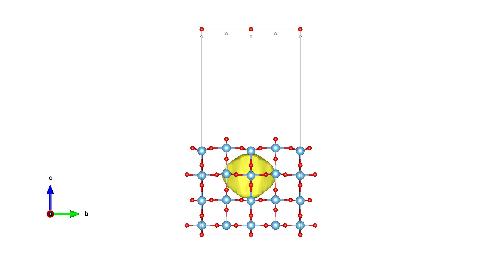
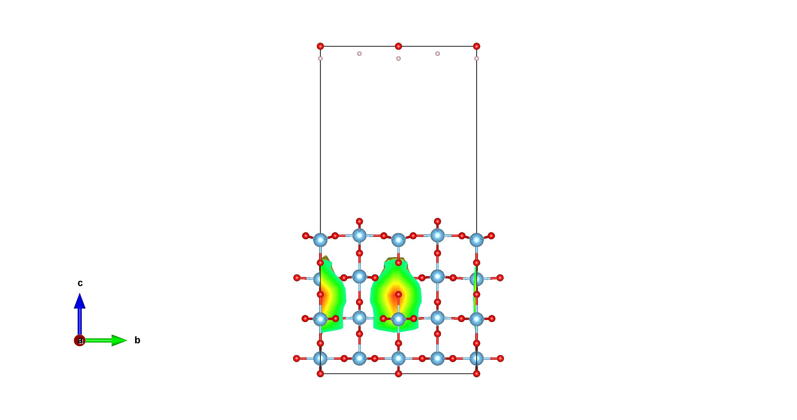

# distortion_hotmap
## Utility
To visulize the lattice distortion after the geometric optimization or along a dynamic trajectory. \\
Input structure file in `vasp` format, output `CHGCAR` like files which can be visualized by `VESTA`.

## Flow chart
1. Data of two corresponding `POSCAR`s
2. Calculate the `displacement matrix`
3. Calculate the `displacement scalar`
4. Plot atomic stick-ball figure
5. Add the hotmap based on `displacement matrix` and `displacement scalars`

## Example

After geo-opt, only bonds around one Ti expanded, forming a small polaron.

A group of Ti atoms expands.

## Bugs
